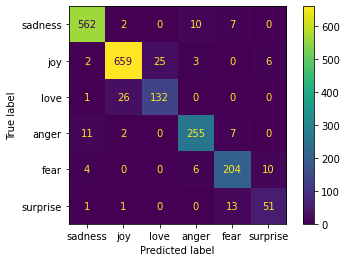
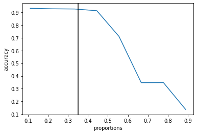

this report is generated using Markdown PDF extension of visual studio code
# Training results

| no | model               |  val_los | train_los | val_accuracy  | test_accuracy| pooling type|
|---|--------------------|---|---|---|---|---|
| 1 | microsoft/deberta-v3-large  | 0.133  |  0.008 |  0.95| 0.93 | MeanPooling| 
| 2 | microsoft/deberta-v3-base | 0.171  |  0.06 |  0.94 | -- | MeanPooling| 
| 3 | roberta-large | 0.18  |  0.01 |  0.94 | -- | MeanPooling|  
| 4 | albert-base-v2 | 0.185  |  0.03 |  0.935 | -- | MeanPooling|
| 5 | distilroberta-base | 0.19  |  0.01 |  0.93 | -- | MeanPooling|

Since we got the highest result from <b style='color:purple'> microsoft/deberta-v3-large </b> on the validation split we will use that model to further analysis.

# Test Metrics with float32:
* Accuracy: 
    - 0.931
* F1 (harmonic mean of Precision and Recall; it is good for inbalanced datasets), weighted
    - 0.93
* Precision (correctly identified positive cases from all the predicted positive cases)
    - 0.93
* Recall (correctly identified positive cases from all the actual positive cases)
    - 0.93

the metrics based on individual classes:

              precision    recall  f1-score

     sadness       0.97      0.97      0.97
         joy       0.97      0.94      0.95
        love       0.81      0.89      0.84
       anger       0.93      0.93      0.93
        fear       0.89      0.86      0.87
    surprise       0.67      0.83      0.74

As you can see surprise has the lowest score and it is being confused with anger alot.
### failing cases:
Failures are really hard to tell apart even by me:
1. 'i feel strange' is predicted as surprise whereas fear is the actual label
2. 'i don t feel particularly agitated' is predicted as anger while the actual label is fear
3. 'i feel blessed to know this family' is predicted as 'joy' wheras actual label is 'love'

# Test Metrics with float16:
* Accuracy: 
    - 0.932
* F1 (harmonic mean of Precision and Recall; it is good for inbalanced datasets), weighted
    - 0.93
* Precision (correctly identified positive cases from all the predicted positive cases)
    - 0.93
* Recall (correctly identified positive cases from all the actual positive cases)
    - 0.93

# Pruning 
We applied unstructured pruning on the data and get the results for both half and full precision model:

full precision : 

half precision : 

we chose 35 percent removal due to its high accuracy.

* pruning results:
    - num params before: 2.7B
    - num params after: 1.9B

# What may  work:
1. Augmentations
2. freezing top n layers
3. Different pooling techniques
4. For efficiency: Qantization